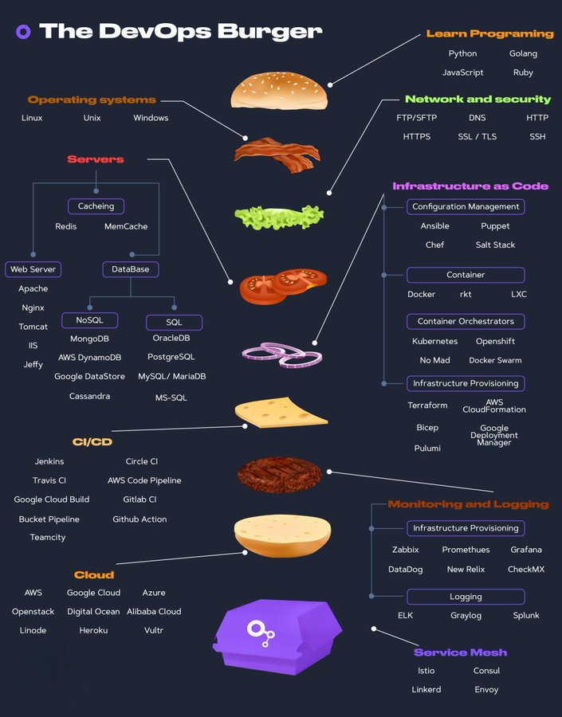

# DevOps Career Roadmap
This is a step-by-step guide on how to become a DevOps engineer, with links to relevant learning resources.

## Give a Star! :star:

If you like or are using this project to learn or start your solution, please give it a star. Thanks!

## Phase 1: Foundations of System Administration & Networking

In this phase, you will learn the fundamentals of Linux, shell scripting, and networking. Key tools include:
- **Linux (Ubuntu, CentOS)**: Master basic commands, file systems, permissions, and more.
- **Networking**: Understand concepts like DNS, HTTP/S, and TCP/IP.
- **Shell Scripting**: Learn Bash and Python scripting for automation.
- **Virtualization**: Use tools like VirtualBox or Vagrant to create virtual environments.
- **Git**: Version control for managing code.
  
---

## Phase 2: Version Control & Continuous Integration (CI)

In this phase, focus on learning how to manage version control and automate the build process. Key tools include:
- **Git**: Master branching, merging, and pull requests.
- **CI/CD Pipelines**: Understand how to automate testing and integration.
- **Tools**: Jenkins, Travis CI, CircleCI, GitLab CI.

---

## Phase 3: Automation & Configuration Management

Here, you will learn to automate infrastructure management and deployments at scale. Key tools include:
- **Infrastructure as Code (IaC)**: Automate resource management with tools like Terraform.
- **Configuration Management**: Use Ansible, Chef, Puppet, or SaltStack for configuration.

---

## Phase 4: Continuous Deployment & Containerization

In this phase, focus on containerizing applications and deploying them. Key tools include:
- **Docker**: Learn to build and manage containers.
- **Kubernetes**: Orchestrate and scale containerized applications.
- **Helm**: Manage Kubernetes applications.
  
---

## Phase 5: Cloud & Monitoring

Learn about cloud platforms and monitoring tools. Key areas include:
- **Cloud Platforms**: AWS, Google Cloud, and Azure.
- **Monitoring Tools**: Prometheus, Grafana, ELK Stack for logs and metrics.
  
---

## Phase 6: Security & Best Practices

Master secure practices for managing infrastructure. Key areas include:
- **Secrets Management**: Use tools like HashiCorp Vault.
- **Cloud Security**: AWS IAM, VPC security, encryption best practices.

---

## Phase 7: Scaling & Performance

Learn how to scale applications and handle high traffic. Key tools and concepts include:
- **Load Balancing**: Use AWS Elastic Load Balancer, Nginx.
- **Service Mesh**: Istio, Linkerd for managing microservices.

---

## Phase 8: Advanced Topics

Explore advanced topics like chaos engineering and serverless architecture. Key areas include:
- **Chaos Engineering**: Tools like Gremlin, Chaos Monkey.
- **Serverless**: AWS Lambda, Google Cloud Functions.

## Detailed plan Ahead

## Table of Contents

- [Learning resources for DevOps Engineers (mostly free)](#learning-resources-for-devops-engineers-mostly-free)
  - [1. GIT](#1-git)
  - [2. Learn one programming language](#2-learn-one-programming-language)
  - [3. Learn Linux & Scripting](#3-learn-linux--scripting)
  - [4. Learn Networking & Security](#4-learn-networking--security)
  - [5. Learn Server Management](#5-learn-server-management)
  - [6. Learn Containers](#6-learn-containers)
  - [7. Learn Container Orchestration](#7-learn-container-orchestration)
  - [8. Learn Infrastructure as a code](#8-learn-infrastructure-as-a-code)
  - [9. Learn CI/CD](#9-learn-cicd)
  - [10. Learn Monitoring & Observability](#10-learn-monitoring--observability)
  - [11. Learn one Cloud provider](#11-learn-one-cloud-provider)
  - [12. Learn Software Engineering Practices](#12-learn-software-engineering-practices)
- [Additional resources](#additional-resources)
  - [Tools](#tools)
  - [Books](#books)

  ## DevOps Engineer Learning Resources (Mostly Free)

### 1. GIT

Your files, including **application code** and **infrastructure as code**, will reside in a GIT repository. **Git** is a free tool for source code management, used to track changes and enable collaboration in non-linear development.

Popular platforms for Git include **GitLab** and **GitHub**. Learn essential Git commands like `git clone`, `branch`, `merge`, and how to work with pull requests.

**Resources:**
- [Pro Git Book](https://git-scm.com/book/en/v2) FREE
- [Learn Git by Atlassian](https://www.atlassian.com/git) FREE
- [Learn Git Branching](https://learngitbranching.js.org/) FREE
- [Learn Git & GitHub on CodeAcademy](https://www.codecademy.com/learn/learn-git) FREE
- [Git Command Explorer](https://gitexplorer.com/) FREE
- [Git Immersion](https://gitimmersion.com/index.html) FREE
- [A Visual Git Reference](http://marklodato.github.io/visual-git-guide/index-en.html) FREE

### 2. Learn a Programming Language

Engineers should know at least one language to write **automation scripts**. Common choices for DevOps include **Python**, **Go**, and **JavaScript**. Python, a multi-paradigm language, is often recommended for beginners due to its readability and versatility.

**Resources:**
- [Automate the Boring Stuff with Python](https://automatetheboringstuff.com/) FREE
- [Python Crash Course](https://ehmatthes.github.io/pcc/) FREE
- [The Modern JavaScript Tutorial](https://javascript.info/) FREE
- [JavaScript Crash Course for Beginners](https://www.youtube.com/watch?v=hdI2bqOjy3c) FREE
- [Eloquent JavaScript, 3rd edition](https://eloquentjavascript.net/) FREE
- [Go by Example](https://gobyexample.com/) FREE

### 3. Learn Linux & Scripting

Since most servers run **Linux**, familiarity with the OS and its command-line interface is essential. You’ll also need scripting knowledge (e.g., **Bash**, **Powershell**) for task automation.

**Resources:**
- [Operating System - Overview](https://www.tutorialspoint.com/operating_system/os_overview.htm) FREE
- [Shell Scripting Tutorial](https://www.shellscript.sh/) FREE
- [Powershell Tutorial](https://www.guru99.com/powershell-tutorial.html) FREE
- [Bash Reference Manual](https://www.gnu.org/savannah-checkouts/gnu/bash/manual/bash.html) FREE
- [Ultimate Guide to Getting Started with Ubuntu](https://itsfoss.com/getting-started-with-ubuntu/) FREE
- [FreeBSD Handbook](https://docs.freebsd.org/en/books/handbook/) FREE
- [Linux Command Handbook](https://www.freecodecamp.org/news/the-linux-commands-handbook/) FREE

### 4. Learn Networking & Security

Understanding **network protocols**, **DNS**, **firewalls**, and the **OSI model** is essential for configuring secure, efficient networks.

**Resources:**
- [OSI Model Explained](https://www.cloudflare.com/en-gb/learning/ddos/glossary/open-systems-interconnection-model-osi/) FREE
- [Computer Networking: A Top-Down Approach](https://www.amazon.com/Computer-Networking-Top-Down-Approach-7th/dp/0133594149) book | [Video Content](https://www.youtube.com/playlist?list=PLByK_3hwzY3Tysh-SY9MKZhMm9wIfNOas) video
- [TCP/IP and Networking Fundamentals for IT Pros](https://www.pluralsight.com/courses/tcpip-networking-it-pros) Pluralsight course
- [DevSecOps: Securing CI/CD](https://www.udemy.com/course/devsecops/) Udemy course
- [Hands-On Security in DevOps](https://www.amazon.com/Hands-Security-DevOps-continuous-deployment/dp/1788995503) book

### 5. Learn Server Management

Managing servers requires knowledge of **proxies**, **caching**, and **web servers** like Nginx and Apache, ensuring high availability and security.

**Resources:**
- [What is a Reverse Proxy?](https://www.cloudflare.com/en-gb/learning/cdn/glossary/reverse-proxy/) FREE
- [Cache Server Overview](https://networkencyclopedia.com/cache-server/) FREE
- [Reverse Proxy vs. Forward Proxy](https://oxylabs.io/blog/reverse-proxy-vs-forward-proxy) FREE
- [NGINX Handbook](https://www.freecodecamp.org/news/the-nginx-handbook/) FREE
- [Learn Apache Server](https://www.twaino.com/en/blog/website-creation/apache-server-2/) FREE
- [Learn IIS](https://www.dnsstuff.com/windows-iis-server-tools) FREE

### 6. Learn Containers

**Containers** encapsulate applications with all dependencies, ensuring they run consistently across environments. **Docker** is the leading container technology.

**Resources:**
- [What are Containers?](https://cloud.google.com/learn/what-are-containers) FREE
- [Learning Containers from the Bottom Up](https://iximiuz.com/en/posts/container-learning-path/) FREE
- [Docker Tutorial for Beginners](https://www.youtube.com/watch?v=3c-iBn73dDE) FREE
- [Docker Mastery](https://www.udemy.com/course/docker-mastery/) Udemy course

### 7. Learn Container Orchestration

**Container orchestration** automates the deployment and scaling of containers. **Kubernetes** is the most popular orchestration tool.

**Resources:**
- [Kubernetes Crash Course for Beginners](https://www.youtube.com/watch?v=s_o8dwzRlu4) FREE
- [Certified Kubernetes Administrator (CKA)](https://www.udemy.com/course/certified-kubernetes-administrator-with-practice-tests/) Udemy course
- [Learn Kubernetes](https://kodekloud.com/learning-path-kubernetes/) FREE

### 8. Learn Infrastructure as Code (IaC)

**Infrastructure as Code (IaC)** allows engineers to automate the setup and management of infrastructure. Popular tools include **Terraform**, **Ansible**, and **Puppet**.

**Resources:**
- [Official Terraform Tutorials](https://learn.hashicorp.com/terraform) FREE
- [Comprehensive Guide to Terraform](https://blog.gruntwork.io/a-comprehensive-guide-to-terraform-b3d32832baca) FREE
- [Puppet Overview](https://puppet.com/docs/puppet/latest/puppet_overview.html) FREE
- [Getting Started with Ansible](https://docs.ansible.com/ansible/latest/getting_started/) FREE

### 9. Learn CI/CD

**CI/CD** automates app development stages from integration to deployment. Popular tools include **Jenkins**, **GitLab**, and **Azure DevOps**.

**Resources:**
- [Continuous Integration](https://martinfowler.com/articles/continuousIntegration.html) FREE
- [CI/CD Pipeline Guide](https://semaphoreci.com/blog/cicd-pipeline) FREE
- [Learn GitLab CI/CD](https://docs.gitlab.com/ee/ci/quick_start/) FREE
- [Jenkins from Zero to Hero](https://www.udemy.com/course/jenkins-from-zero-to-hero) Udemy course

### 10. Learn Monitoring & Observability

Monitoring provides real-time insights into application performance. Popular tools include **Prometheus** and **Grafana**.

**Resources:**
- [What Is Observability?](https://devopscube.com/what-is-observability/) FREE
- [Learn Prometheus](https://prometheus.io/docs/tutorials/getting_started/) FREE
- [Learn Grafana](https://grafana.com/tutorials/) FREE

### 11. Learn a Cloud Provider

Cloud providers, such as **AWS**, **Azure**, and **Google Cloud**, offer APIs to provision and manage infrastructure. Learn to handle users, networks, and virtual machines.

**Resources:**
- [Exam AZ-900: Microsoft Azure Fundamentals](https://learn.microsoft.com/en-us/certifications/exams/az-900) FREE
- [AWS Developer by A Cloud Guru](https://acloudguru.com/learning-paths/aws-developer) Learning Path

### 12. Learn Software Engineering Practices

Working in a **DevOps** role involves following **Agile** practices and understanding the **software development lifecycle (SDLC)**.

**Resources:**
- [What is Scrum?](https://www.atlassian.com/agile/scrum) FREE
- [Software Development Life Cycle (SDLC)](https://www.guru99.com/software-development-life-cycle-tutorial.html) FREE
- [Software Development Life Cycle (SDLC) Phases & Models](https://www.guru99.com/software-development-life-cycle-tutorial.html) FREE
- [The Beginner's Guide to Agile in Jira: Course description](https://university.atlassian.com/student/page/1117976-the-beginner-s-guide-to-agile-in-jira-course-description?sid_i=8) FREE
- [Learn SAFe](https://www.scaledagileframework.com/) FREE
- [Learn Automation Testing](https://blog.testproject.io/2020/03/26/automation-testing-for-beginners-ultimate-guide/) FREE
- [GitLab - Beginner's Guide to DevOps](https://page.gitlab.com/resources-ebook-beginners-guide-devops.html) FREE
- [Common SDLC Models](https://www.scaler.com/blog/software-development-life-cycle/#common-sdlc-models) FREE

## Additional resources

### Tools

- **Work Tracking**:** [Asana](https://asana.com/), [Monday](https://monday.com/), [Jira](https://www.atlassian.com/software/jira), [Trello](https://trello.com/), [Azure Boards](https://azure.microsoft.com/en-au/products/devops/boards/).
- **Source code control**: [Git](https://git-scm.com/), [Github](https://github.com/), [GitLab](https://about.gitlab.com/), [BitBucket](https://bitbucket.org/), [Azure DevOps](https://azure.microsoft.com/en-us/products/devops).
- **CI/CD**: [Jenkins](https://www.jenkins.io/), [Team City](https://www.jetbrains.com/teamcity/), [Github Actions](https://github.com/features/actions), [Travis CI](https://www.travis-ci.com/), [Bamboo](https://www.atlassian.com/software/bamboo), [Circle CI](https://circleci.com/), [Azure Pipelines](https://azure.microsoft.com/en-us/products/devops/pipelines/), [Octopus Deploy](https://octopus.com/), [Harness](https://www.harness.io/), [CloudBees CodeShip](https://www.cloudbees.com/products/codeship).
- **Source Code Analysis**: [SonarQube](https://www.sonarsource.com/products/sonarqube/), [Veracode](https://www.veracode.com/).
- **Artifact management**: [Artifactory](https://jfrog.com/artifactory/), [Docker Container Register](https://docs.docker.com/registry/), [npm](https://www.npmjs.com/), [Yarn](https://yarnpkg.com/), [NuGet](https://www.nuget.org/).
- **Configuration Management**: [Terraform](https://www.terraform.io/), [Ansible](https://www.ansible.com/), [Puppet](https://www.puppet.com/), [Chef](https://www.chef.io/).
- **Container orchestration**: [Docker](https://www.docker.com/), [Kubernetes](https://kubernetes.io/), [Red Hat OpenShift](https://www.redhat.com/en/technologies/cloud-computing/openshift).
- **Monitoring**: [Prometheus](https://prometheus.io/), [Grafana](https://grafana.com/), [Splunk](https://www.splunk.com/), [Dynatrace](https://www.dynatrace.com/), [Kibana](https://www.elastic.co/kibana/).

### Books

- **[The DevOps Handbook: How to Create World-Class Agility, Reliability, and Security in Technology Organizations](https://amzn.to/3IJPv0h)**, Gene Kim, Patrick Debois, John Willis, Jez Humble 

    The book introduces product development, quality assurance, IT operations, and information security. It is a great read for those who are new to DevOps or who want to learn more about how the various components of DevOps work together.

- **[Accelerate: The Science of Lean Software and DevOps: Building and Scaling High Performing Technology Organizations](https://amzn.to/3XRShoA)**, Nicole Forsgren, Jez Humble, Gene Kim 

    This book presents both the findings and the science behind measuring software delivery performance. For promoting DevOps to senior management, it's a fantastic tool.

- **[Continuous Delivery: Reliable Software Releases through Build, Test, and Deployment Automation ](https://amzn.to/3XRShoA)**, Jez Humble, David Farley 

    It introduces automated architecture management and data migration. Many of the deployment pipeline concepts that have since become standard were established in this book. Config as Code, build and deployment automation, and efficient testing techniques are covered in some technical detail. Its mostly technical book.

- **[Team Topologies: Organizing Business and Technology Teams for Fast Flow](https://amzn.to/3Zb83fl)**, Matthew Skelton, Manuel Pais

    The book talks about how to organize teams in a way that enables fast flow of value to customers. It provides a set of four fundamental team topologies: Stream-Aligned Teams, Enabling Teams, Complicated-Subsystem Teams, and Platform Teams, which can be combined and adapted to suit different organizational contexts. 

- **[Effective DevOps: Building a Culture of Collaboration, Affinity, and Tooling at Scale](https://amzn.to/3Za5aLH)**, Jennifer Davis, Ryn Daniels

    The book provides effective ways to improve team coordination. It shows how to break down information silos, monitor relationships, and repair misunderstandings that arise between and within teams in your organization.

- **[The Phoenix Project: A Novel about IT, DevOps, and Helping Your Business Win](https://amzn.to/3Z6VSQG)**, Gene Kim, Kevin Behr, George Spafford

    It is a classic novel about effectiveness and communications. IT work is like manufacturing plant work, and a system must be established to streamline the workflow. One of the best books out there.

- **[Site Reliability Engineering](https://sre.google/books/)**, Betsy Beyer, Chris Jones, Jennifer Petoff, Niall Richard Murphy 

    This book explains the whole life cycle of Google’s development, deployment, and monitoring, and how to manage the world’s biggest software systems (also known as SRE). Anyone who considers themselves to be more on the "Ops" end of the DevOps side or who wants to know how to strengthen the bonds between various Dev and Ops teams should read SRE.

## DevOps as a Burger (DaaB)

We can even present this roadmap as a burger :).

## Wrap Up

If you think the roadmap can be improved, please open a PR with any updates and submit any issues. Also, I will continue to improve this, so you might want to star this repository to revisit.

## Contribution

- Open a pull request with improvements
- Discuss ideas in issues
- Spread the word

## License

